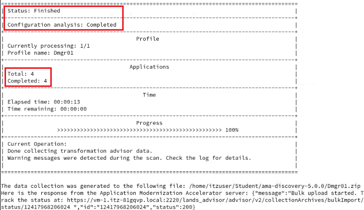
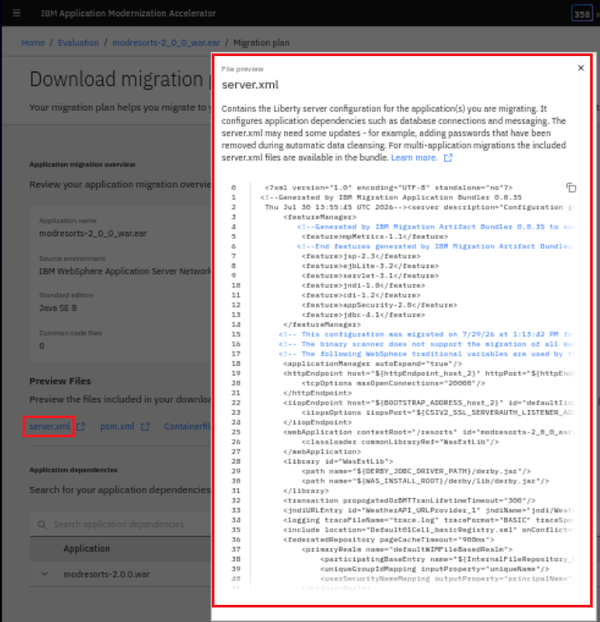
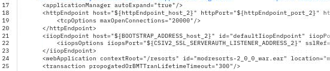
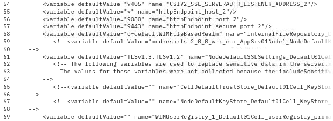

# IBM Modernized Runtime Extension for Java Hands-On Lab 1648 in TechXchange 2026


**Duration:** 90 minutes

# Introduction

[IBM Modernized Runtime Extension for Java](https://www.ibm.com/docs/en/more) (MoRE) is an extension of WebSphere® Application Server Network Deployment (ND) 9.0.5 that enables you to run and manage Liberty servers from the traditional WebSphere environment. With MoRE, Liberty servers can be configured, clustered, and administered using familiar tools like the administrative console and wsadmin scripting.

[IBM Application Modernization Accelerator](https://www.ibm.com/docs/en/ama) has the capability to quickly evaluate your on-premises applications for rapid deployment on WebSphere Application Server and Liberty on public and private cloud environments. The first step is to download and run a custom discovery tool on your application servers. Results from the scan are uploaded to Application Modernization Accelerator where a detailed analysis is provided.

Application Modernization Accelerator creates a high-level inventory of the content and structure of each application. This information is used to determine complexity and identify the shared library and MQ Queue Manager dependencies for your applications. Application Modernization Accelerator also flags potential issues and estimates a development cost to complete a move to the cloud. Detailed reports with advice, suggestions, and best practices are provided to ensure that the application runs correctly in the preferred cloud environment.


## About this hands-on lab

This lab provides fundamental hands-on experience of the evaluation process of WebSphere application for their modernization journey to MoRE. It shows the value of using Application Modernization Accelerator (AMA) to evaluate on-premises Java applications, modernise using IBM Bob and then deploy to MoRE. In this interactive, hands-on lab, you'll explore the cutting-edge capabilities of WebSphere Application Server and MoRE, which are designed to supercharge your modernization journey. 

Through guided modules, you'll deploy modern Jakarta EE to a Managed Liberty server, using the WebSphere Administrative Console and/or automation with wsadmin scripts. Whether you're modernizing legacy systems or building cloud-native apps, this lab is your launchpad into the next generation of enterprise application management.

Upon completion of this lab, you will have gained experience using AMA to quickly analyze on-premises Java applications without accessing their source code, estimate the effort in moving to container-based clouds, and using IBM Bob to update the source code to accelerate your application modernization journey to MoRE.

---
# Getting started

This section guides you through the initial setup of the lab environment. Perform all tasks from the student virtual machine.

## Lab environment overview

The lab environment is preinstalled with the following packages:
* The Application Modernization Accelerator, version 5.0
* IBM Bob 2.0.3
* WebSphere Application Server Network Deployment (ND), version 9.0.5.28, running on Java SE 8

    * Modernized Runtime Extension for Java (MoRE), version 1.0.4.0

    * IBM HTTP Server (IHS) and Web Server Plug-ins for WebSphere Application Server

* WebSphere Liberty, version 26.0.0.6, running on Java SE 21

In addition, the environment is preconfigured with the following profiles and server instances:

* A Deployment Manager (`dmgr`), which serves as the central controller for the WebSphere cell.

* Two managed nodes, `node1` and `node2`, both federated into the same cell as the `dmgr`.

* A preconfigured web server, `webserver1`, running on `node2`, which listens on ports `7777` (HTTP) and `8888` (HTTPS). This server forwards incoming requests to applications running on the Liberty cluster via IHS and the WebSphere Plugin, allowing external access without directly exposing Liberty server ports.

All components are installed under `/home/techzone/IBM` on the student virtual machine.

## Cloning the lab repository

Open a command-line terminal and run the following commands to clone the lab repository to your environment:

```sh
cd /home/techzone/Student

git clone https://github.com/Emily-Jiang/tx-more-lab-2026.git
cd tx-more-lab-2026
```
## Explore Application Modernization Accelerator
In this section, you will explore the main capabilities of Application Modernization Accelerator. You will use the sample data that is shipped with the product. 

### Start AMA

Application Modernization Accelerator(AMA) is already installed and typically running. 

Let's check if AMA is already started. This can be validated by reviewing if the related podman containers are started. 

1. Open a terminal by clicking on Activities and selecting terminal.

    <kbd></kbd>

    The terminal window opens.  

    <kbd></kbd>

    HINT: By default, the terminal window has a dark background.

2. Access the AMA launch script to verify if AMA is started or not

        cd ~/usr/IBM/application-modernization-accelerator-local-*
        ./launch.sh

        
    Check the status if AMA is started. 
    If AMA **is available** (see screenshot below), enter **q** to quit the menu and keep AMA running. 

    <kbd></kbd>

    If AMA is avalable, enter **q** to quit the script.

    If AMA is **not running** (see screenshot below), enter **5** to start AMA. 
    <kbd></kbd>
        
    Wait until AMA has started and the URL is displayed
    <kbd></kbd>


## Build and analyze the modresorts application

### 6.3 Build and deploy the WebSphere applications

The objective of this section is to assess the ModResort application that has been deployed to a traditional WAS 9 instance.

#### 6.3.1 Build the WAS application

1. Install the required WAS library

       cd modresorts-project/

       mvn install:install-file -Dfile=/home/itzuser/usr/IBM/WebSphere/AppServer/dev/was_public.jar -DpomFile=/home/itzuser/usr/IBM/WebSphere/AppServer/dev/was_public-9.0.0.pom

    Make sure that the build is successful.

    <kbd></kbd>

2. Build the application
    
       mvn clean package

    <kbd></kbd>

    <kbd></kbd>

3. Copy the generated war file into the assets directory
    
        cp target/modresorts-2.0.0.war ~/Student/assets/


#### 6.3.2 Deploy the WebSphere application and test it

The application has not been installed to traditional WAS so far. You will now perform the following steps:
- Start the WAS ND Deployment Manager and a Node Agent
- Deploy the application via wsadmin to the WAS ND server1 instance
- Configure WAS for the application
- Start server1
- Test the application if it works fine on traditional WAS.

1. In the terminal window, enter the following command to start the Deployment Manager

        ~/usr/IBM/WebSphere/AppServer/profiles/Dmgr01/bin/startManager.sh

    Wait until the Deployment Manager has been started

    <kbd></kbd>

2. Enter the following command to start the Note Agent

       ~/usr/IBM/WebSphere/AppServer/profiles/AppSrv01/bin/startNode.sh

    Wait until the Node agent has been started
    
    <kbd></kbd>

3. Deploy the application using wsadmin by entering the following commands:

        cd ~/Student/modresorts-project/tWAS-Scripts

        ~/usr/IBM/WebSphere/AppServer/profiles/Dmgr01/bin/wsadmin.sh -f ./modresorts_install.py

    <kbd></kbd>


4. Set the URLProvider which is used by the modresorts application via wsadmin by entering the following commands:

        ~/usr/IBM/WebSphere/AppServer/profiles/Dmgr01/bin/wsadmin.sh -f ./setURLProvider.py

    <kbd></kbd>

5. Enter the following command to start the WAS server server1

       ~/usr/IBM/WebSphere/AppServer/profiles/AppSrv01/bin/startServer.sh server1

    Wait until the server serer1 has been started
    
    <kbd></kbd>

6. Test the application

    1. Open a browser window by clicking on **Activities** and then select the **Firefox** browser icon.

        <kbd></kbd>

    2. Access the tWAS application using the URL http://localhost:9080/resorts

    <kbd></kbd>


    3. Click on **Where to?** and switch to Paris or another city. 
    (If the button does not work, make sure that the browser is in full-screen.)

    <kbd></kbd>

    Verify that there are no errors shown. 
    
    <kbd></kbd>
    
    4. Click on the **Logout** button.

    <kbd></kbd>

    Verify that there are no errors shown. 
    
    <kbd></kbd>

    If everything worked fine, there should be no error displayed.
    You will test the same application later on as is if it works on Liberty as well.

7. Switch back to the terminal window and stop the WAS cell.

        ~/usr/IBM/WebSphere/AppServer/profiles/AppSrv01/bin/stopServer.sh server1
        ~/usr/IBM/WebSphere/AppServer/profiles/AppSrv01/bin/stopNode.sh
        ~/usr/IBM/WebSphere/AppServer/profiles/Dmgr01/bin/stopManager.sh

As you have seen, the application works without any issue on WebSphere Traditional v9. The next step is to assess the application via AMA to find out which issues must be resolved to make the application work on Liberty with Java 8.

### 6.4 Create an AMA data collection for the WAS applications

You will now switch back to the AMA User Interface and create a new workspace called **Evaluation**. Then you will download the AMA Discovery Tool to scan the existing WebSphere landscape.

To evaluate on-premises Java applications, you need to run the AMA Discovery Tool against the Application server environment. It will extract application information from the environment. The utility can be downloaded from the AMA.

1. Create in AMA a new workspace and download the AMA Discovery Tool.
    1. Switch back to the browser and open the existing AMA window.
    Then click on **Home**
        
        <kbd></kbd>

        (If you closed the browser window, open a new browser window and enter the URL https://localhost:3000)

    2. You should now be back on the AMA Overview page:

        <kbd></kbd>
    

    3. Click on the button **Create workspace** and enter **Evaluation**, do NOT select **include sample data**, then click on **Create**.

        <kbd></kbd>
    
    4. An empty workspace will be created, and you will be asked if you want to upload an existing data collection or if you want to use the Discovery Tool.
        <kbd></kbd>
    
    5. Click on **Open discovery tool**.
        <kbd></kbd>
    The Discovery Tool panel opens and provides the option to download the tool; in addition, it provides information how to use the tool. 
    6. Click on **Download discovery tool**.
    <kbd></kbd>

        The discovery tool package will be generated and prepared for download.
        Once done, you will likely get a warning, that there is a potential security risk, click on **Advanced** and then **Accept the Risk and Continue**. 

        <kbd></kbd>

    
        The AMA Discovery Tool package will be generated and downloaded.
        <kbd></kbd>
    
        It will include next to the scanner also the information to upload the data collection once created.

    7. Click the back button to return to the Discovery Tool page.

        <kbd></kbd>
    
    
2. Use the AMA Discovery Tool to analyze the installed WebSphere Applications.

    Run the AMA Discovery Tool against your WebSphere environment. After downloading the zipped Data Collector utility, it needs to be unpacked and run against a WebSphere Application server (WAS) to collect all the data of deployed applications and their configuration from the WAS server.

    1. Go back to the Terminal window and navigate the /home/itzuser/Downloads directory and view its contents with commands:

            cd /home/itzuser/Downloads/
            ls -l | grep Discovery

        <kbd></kbd>
            
        You can see the downloaded Discovery Tool file named “DiscoveryTool-Linux_Evaluation.tgz”

    2. Extract the data collector utility to the Student directory using the following command:

            tar xvfz DiscoveryTool-Linux_Evaluation.tgz -C ~/Student

        The Discovery Tool will be extracted to ~/Student/ama-discovery-5.0.0 directory.

        Note: At this point, the data collector is ready to execute against a WebSphere environment.

    3. Return to the AMA UI in the Web browser to view the section on “Run the Tool”, which shows the command to run on the WebSphere environment.

        a. From the Discovery Tool page, scroll down to the “Run Tool” section.

        <kbd></kbd>
        
        The Discovery tool command that would be executed is based on the domain and analysis type selections you make in this section.

        b. Select the domain.

        Open the twisty to see the different domain options:

        <kbd></kbd>
        
        Change the domain and you can see that the command will change.
        Finally, switch back to the **IBM WebSphere** Domain. 

        c. Select the Analysis type
        
        Open the twisty to see the different analysis types:

        <kbd></kbd>
        
        Change the analysis type and you can see that the command will change. Finally, switch back to the **Apps & Configuration** analysis. 
        Selecting **Apps & Configuration** ensures that the application data and server configuration data is collected.
 
        The server configuration data is extremely helpful in Transformation Advisor to generate deployment artifacts in the migration bundle, which we will explore later in the lab.
 
        d. Review the final command.
        To analyze the application and configuration for WebSphere will be done using a command as shown in the screenshot
        <kbd></kbd>
    

6.  Execute the AMA Discovery Tool.

    1. Go back to the Terminal window and navigate the directory where the AMA Discovery Tool was extracted, then list the content:

            cd ~/Student/ama-discovery-*
            ls -l

        <kbd></kbd>


    2.  Execute the following command to start the AMA Discovery Tool:

            ./bin/ama-discovery -w ~/usr/IBM/WebSphere/AppServer

        <kbd></kbd>

        The license agreement will be displayed, and you will be asked to accept it. 
        
        <kbd></kbd>
        

        Type **1** to accept the license agreement and press **Enter**.

    3. Wait until the analysis has completed. As you can see, 4 applications have been analyzed, and the resulting data collection has been automatically uploaded. 

        <kbd></kbd>
    
        The collection is also available as zip file in the directory where the discovery tool was called. It is named like the WAS profile.

            ls -l

        <kbd></kbd>


        Comments: 
        - In the lab, the process only takes a couple of seconds. In a real scenario, the process typically takes some time to complete, depending on how many applications are deployed on the WebSphere Application server and the complexity of the applications. As this process consumes some CPU and memory, it is not recommended to run the discovery tool in production.
        - You might have recognized that the WebSphere applications were discovered even though the WebSphere instances were stopped. This is due to the fact that the discovery tools looks into the WebSphere files instead of connecting to a running instance.
        - In the lab environment, the discovery tool can connect to the AMA instance via port 2220. Therefore the collected data has been automatically uploaded. If this is not the case, you must copy over the data collection zip to another system and manually upload the data to AMA from that system before you can view the results. 
        - You can also specify in the ama-discovery command not to upload the data collection automatically. 


    4. Return to the AMA UI in the Web browser and you can see that the data collection has been uploaded. 
    
        <kbd></kbd>

    5. Click on the **Evaluation** workspace to open it.  
    You will be asked to specify the modernization destination. Select **MoRE** as destination and click on **Confirm**.
    

        The Evaluation workspace will open in the Visualization View. 
    
        <kbd></kbd>

        You can see the 4 applications that have been discovered.

    
    **IMPORTANT!**
    
    As backup for this lab, we have placed the data collection archive (zip file) at: ~/Student/modresorts-project/ama/Dmgr01.zip. 
    ___


### 6.6  Examine the Liberty modernization assets generated by AMA

AMA not only provides great insights about your applications that you consider modernizing to WebSphere Liberty, but it also generates deployment accelerators for building and deploying the application on Liberty, containers, and Kubernetes based clouds. 

In this section, we take a quick peak at the **Liberty server configuration** `server.xml` that AMA generates, based on the analysis of the WebSphere configuration when the Transformation Advisor data collector was run against the WebSphere server on the VM.  

Simply put, AMA creates the server.xml file that contains the Liberty server configuration required to run the application on Liberty.  

1.	On the modresorts page, click on the button in the upper right called **View migration plan**.

    <kbd></kbd>

 
2.	The **Migration plan** displays a "partial list" of files generated by AMA to assist in the migration of the application.

    - **server.xml:** the configuration for the Liberty server
    - **pom.xml:** Build the application using Maven


3.	Click to view the contents of the **server.xml** file.
	The **server.xml** is displayed in the File preview window, click **`Show more`** to expand it.    
    <kbd></kbd>

4.	Review the contents of the **server.xml** file.

    Notice that AMA generated the **server.xml** file that includes the Liberty server configuration that has been mapped from the original WebSphere traditional application server. 

    When the AMA Discovery Tool was run against the WebSphere Application server, it analyzed the applications and the WebSphere server configuration. The WAS server configuration data was used to generate an appropriate server.xml file to configure the application on Liberty. 

    a.	The **Liberty features** that the application uses are configured. 

    <kbd></kbd>

    b.	The **application endpoints** and **enterprise application module configuration** including **context root**, **Security roles** used by the application are configured. Notice that **variables ${ }** are used to simplify external configuration overrides and default values. 

    <kbd></kbd>

    c.	**Resource configurations** like URLProviders, JDBC or JMS Provider, etc.

    <kbd></kbd>


    d.	**Variables** with default values, where it makes sense are configured.
    These variables are used to make the configuration portable so that it can be used in different stages.

    <kbd></kbd>

    The variables are easily overridden by environment variables or configMaps and secrets in Kubernetes environments. 

    e. Close the File Preview, then scroll down and open the twisty to see application dependencies. As you can see, the application has no dependencies

    <kbd></kbd>


5. Click to download the **Migration Plan** generated by AMA.

    <kbd></kbd>

    The migration plan will be downloaded to the Downloads directory.
    <kbd></kbd>

    
10.	Switch to the terminal window and execute the following command to see the content of the migration bundle. 

        unzip -t ~/Downloads/modresorts-2_0_0_war.ear_migrationPlan.zip 

    
    <kbd></kbd>

    Next to the files mentioned before, the migration bundle contains several other files for Kubernetes deployment, for kustomization as well as placeholder files for the application and the JDBC drivers.


11. Close the browser window containing the AMA UI.


### 6.8 Recap

Congratulations, you have finished the application assessment part.

**Let’s recap what you did so far.** 

- You installed and tested the modresorts application on a traditional WAS instance
- You ran the AMA Discovery Tool to assess a WebSphere cell
- You assessed the modresorts application
- You generated a migration plan


## Starting WebSphere and IHS servers

The [`scripts/start-was-servers.sh`](scripts/start-was-servers.sh) script starts all preconfigured WebSphere components required for the lab, including the Deployment Manager, both node agents, and `webserver1`.

Run the following command to execute the script:

```sh
./scripts/start-was-servers.sh
```
After the script completes, the message `All servers have been started!` is displayed.

---
# Creating a static managed Liberty server cluster

This section guides you through the process of creating a static managed Liberty server cluster.

You can use either of the following methods to complete this task:
* If you prefer a visual, step-by-step experience, continue with [Option 1: Using the administrative console](#option-1-using-the-administrative-console).
* If you prefer automation or scripting, skip ahead to [Option 2: Using administrative scripting](#option-2-using-administrative-scripting).

## Option 1: Using the administrative console

1. Launch the **WAS Admin Console** by selecting it from your browser bookmarks or navigating to the https://localhost:9043/ibm/console URL.

   Log in using the following credentials:
   * User ID: `techzone`
   * Password: `IBMDem0s!` (Note that the zero is used instead of the letter "O")

2. Navigate to **Servers** &rarr; **Clusters** &rarr; **WebSphere application server clusters**. Click **New...** to create a new cluster.

   

3. On **Step 1**, set **Cluster name** to `MLSCluster`. Leave the other fields as default. Click **Next**.

4. On **Step 2**, configure the first cluster member:

   * **Member Name**: `libertyServer`
   * **Select node**: `node1`
   * **Select basis for first cluster member**: choose **Create the member using an application server template**, then select `default-managed-liberty-server` from the dropdown

   Leave all other settings as default. Click **Next**.

5. On **Step 3**, configure the second cluster member:

   * **Member Name**: `libertyServer`
   * **Select node**: `node2`

   Leave the other fields as default. Click **Add Member**, then click **Next**.

6. On **Step 4**, review the configuration summary and click **Finish**.

7. Click <ins>Review</ins>.

   

8. Select **Synchronize changes with Nodes**, then click **Save** to apply the configuration and synchronize with both nodes.

   

9. After synchronization completes, click **OK**.

   

10. Return to **Servers** &rarr; **Clusters** &rarr; **WebSphere application server clusters**. Locate <ins>MLSCluster</ins> in the list and ensure it is present. Check the box next to it, then click **Start** to initiate the cluster. Wait until the status displays a green arrow, indicating that it is running.

    

> [!NOTE]
> After some wait, if the cluster does not show as started, you might want to check the servers status via **Servers** &rarr;  **All Servers** &rarr; and then the cluster servers. If the  servers are started, you are ready to go.

## Option 2: Using administrative scripting

Run the following command to create and start the cluster using the provided Jython script [`createMLSCluster.py`](scripts/createMLSCluster.py):

```sh
/home/techzone/IBM/WebSphere/AppServer/profiles/Dmgr01/bin/wsadmin.sh \
  -lang jython -user techzone -password IBMDem0s! \
  -f /home/techzone/Student/tx-more-lab/scripts/createMLSCluster.py
```

The script performs the following actions:

* Creates the static cluster named `MLSCluster`
* Adds one managed Liberty server on each node
* Synchronizes the configuration across nodes
* Starts the Liberty cluster

When the cluster starts successfully, the message `!!!Successfully started the cluster!!!` is displayed.

---
# Next steps

Proceed to [Module 1](module1/README.md) to deploy a Java 21 and Jakarta EE 10 application to the managed Liberty cluster.

---
# Troubleshooting

This section provides guidance on troubleshooting common issues during the lab.

## Resetting the lab environment

If you encounter problems or want to start the lab from scratch, you can reset the environment to its original state by running:

```sh
/home/techzone/Student/tx-more-lab/scripts/reset-lab-env.sh
```

To remove the cloned lab repository, run:

```sh
cd /home/techzone/Student
rm -rf tx-more-lab-2026
```

This ensures you’re starting from a clean workspace.


