# IBM Modernized Runtime Extension for Java Hands-On Lab 1648 in TechXchange 2026

**Duration:** 90 minutes

# 1. Introduction

Modernizing Java applications doesn't mean manual work or abandoning your operational model. This lab walks you through a smooth and automatic end-to-end enterprise Java modernization workflow using IBM Application Modernization Accelerator (AMA), IBM Bob, and IBM Modernized Runtime Extension for Java (MoRE). 

[IBM Application Modernization Accelerator](https://www.ibm.com/docs/en/ama) has the capability to quickly evaluate your on-premises applications for rapid deployment on WebSphere Application Server and Liberty on public and private cloud environments. The first step is to download and run a custom discovery tool on your application servers. Results from the scan are uploaded to Application Modernization Accelerator where a detailed analysis is provided with advice, suggestions, and best practices are provided to ensure that the application runs correctly in the preferred destination environment.

[IBM Bob](https://bob.ibm.com/) is an AI-powered integrated development environment (IDE) and software development partner to assist enterprises throughout the entire software development lifecycle. IBM Bob offers Premium packages, which has additional workflows. This lab uses the Liberty Replatform workflow from the Premium package to assist migrating your applications to a managed Liberty server in IBM Modernized Runtime Extensions for Java.

[IBM Modernized Runtime Extension for Java](https://www.ibm.com/docs/en/more) (MoRE) is an extension of WebSphere® Application Server Network Deployment (ND) 9.0.5 that enables you to run and manage Liberty servers from the traditional WebSphere environment. With MoRE, Liberty servers can be configured, clustered, and administered using familiar tools like the administrative console and wsadmin scripting.

## 1.1 About this hands-on lab

This lab provides fundamental hands-on experience of the evaluation process of WebSphere application for their modernization journey to MoRE. It shows the value of using Application Modernization Accelerator (AMA) to evaluate on-premises Java applications, modernise using IBM Bob and then deploy to MoRE. In this interactive, hands-on lab, you'll explore the cutting-edge capabilities of WebSphere Application Server and MoRE, which are designed to supercharge your modernization journey. 

Upon completion of this lab, you will have gained experience using AMA to quickly analyze on-premises Java applications without accessing their source code, and using IBM Bob to update the source code to accelerate your application modernization journey to MoRE.

You'll then deploy the modernized Modresort app to a Managed Liberty server in MoRE, using the WebSphere Administrative Console and/or automation with wsadmin scripts. 

---
# 2. Getting started

This section guides you through the initial setup of the lab environment. Perform all tasks from the student virtual machine.

## 2.1 Lab environment overview

The lab environment is preinstalled with the following packages:
* The Application Modernization Accelerator, version 5.0
* IBM Bob 2.1.0
* WebSphere Application Server Network Deployment (ND), version 9.0.5.28, running on Java SE 8

    * Modernized Runtime Extension for Java (MoRE), version 1.0.3.0

    * IBM HTTP Server (IHS) and Web Server Plug-ins for WebSphere Application Server

* WebSphere Liberty, version 26.0.0.6, running on Java SE 21

In addition, the environment is preconfigured with the following profiles and server instances:

* A Deployment Manager (`dmgr`), which serves as the central controller for the WebSphere cell.

* one managed node, `AppSrv01Node1` federated into the same cell as the `dmgr`.

All components are installed under `/home/itzuser/usr/IBM` on the student virtual machine.

# 3. Build and analyze the modresorts application.

## 3.1 Verify the installed software

1. Open a terminal by clicking on Activities and selecting terminal.

    <kbd></kbd>

    The terminal window opens.

    <kbd></kbd>

2. Check the Maven version via the following command:

        mvn -v

    <kbd></kbd>
    
    The version might be slightly different, but must be higher than 3.8.5

3. Check the Git version via the following command:

        git -v

    <kbd></kbd>

    The version might be slightly different.

## 3.2 Create the required working directories

1. Create the Student directories and some sub-directories used in the lab with commands:

       mkdir ~/Student
       mkdir ~/Student/assets
       mkdir ~/Student/backup

## 3.3 Build and deploy the WebSphere applications

The objective of this section is to assess the simple-pharmacy application that has been deployed to a traditional WAS 9 instance.

### 3.3.1 Build the WAS application

1. Clone the repository to get access to the application binaries and more.

       rm -rf ~/Student/temprepo/
       git clone https://github.com/Emily-Jiang/tx-more-lab-2026 ~/Student/temprepo
       mv ~/Student/temprepo/modresorts-project ~/Student
       rm -rf ~/Student/temprepo/

2. Install the required WAS library

        cd ~/Student/modresorts-project/

       mvn install:install-file -Dfile=/home/itzuser/usr/IBM/WebSphere/AppServer/dev/was_public.jar -DpomFile=/home/itzuser/usr/IBM/WebSphere/AppServer/dev/was_public-9.0.0.pom

    Make sure that the build is successful.

    <kbd></kbd>

3. Build the application
    
       mvn clean package

    <kbd>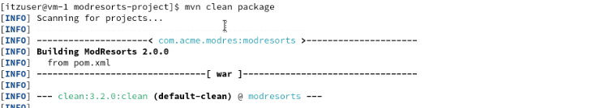</kbd>

    <kbd>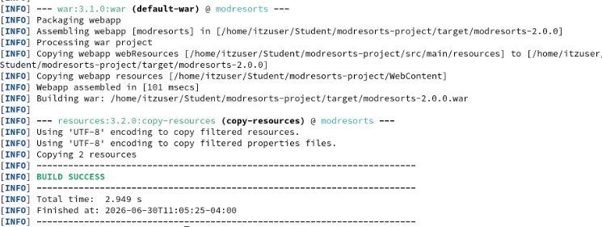</kbd>

4. Copy the generated war file into the assets directory
    
        cp ~/Student/modresorts-project/target/modresorts-2.0.0.war ~/Student/assets/

### 3.3.2 Deploy the WebSphere application and test it

The application has not been installed to traditional WAS so far. Typically, you would do this now in detail, but this is out of scope here. Please look into the details about the required steps.

Open a terminal window and enter the following commands to install the application:

    ~/usr/IBM/WebSphere/AppServer/profiles/Dmgr01/bin/startManager.sh

    cd ~/Student/modresorts-project/tWAS-Scripts

    ~/usr/IBM/WebSphere/AppServer/profiles/Dmgr01/bin/wsadmin.sh -f ./modresorts_install.py

    ~/usr/IBM/WebSphere/AppServer/profiles/Dmgr01/bin/wsadmin.sh -f ./setURLProvider.py

    ~/usr/IBM/WebSphere/AppServer/profiles/Dmgr01/bin/stopManager.sh

# 4. Explore Application Modernization Accelerator
In this section, you will explore the main capabilities of Application Modernization Accelerator. 

## 4.1 Start AMA

Application Modernization Accelerator(AMA) is already installed and typically running. 

Let's check if AMA is already started. This can be validated by reviewing if the related podman containers are started. 

Access the AMA launch script to verify if AMA is started or not

        cd ~/usr/IBM/application-modernization-accelerator-local-*
        ./launch.sh

        
    Check the status if AMA is started. 
    If AMA **is available** (see screenshot below), enter **q** to quit the menu and keep AMA running. 

    <kbd></kbd>

    If AMA is avalable, enter **q** to quit the script.

    If AMA is **not running** (see screenshot below), enter **5** to start AMA. 
    <kbd>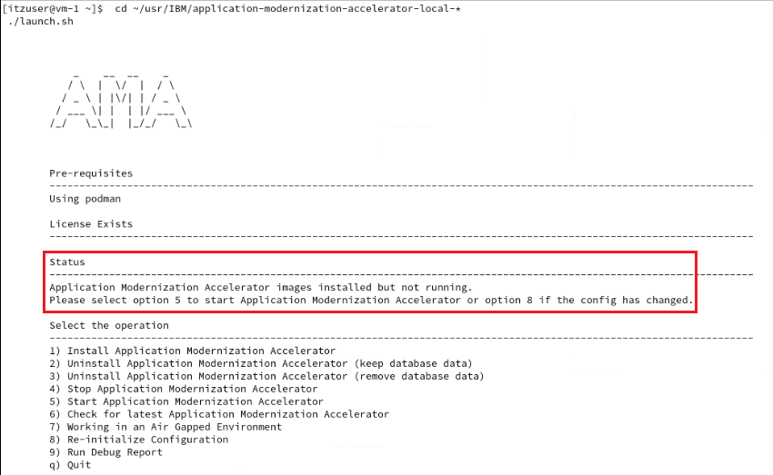</kbd>
        
    Wait until AMA has started and the URL is displayed
    <kbd></kbd>

## 4.2 Create an AMA data collection for the WAS applications

You will now switch back to the AMA User Interface and create a new workspace called **Evaluation**. Then you will download the AMA Discovery Tool to scan the existing WebSphere landscape.

To evaluate on-premises Java applications, you need to run the AMA Discovery Tool against the Application server environment. It will extract application information from the environment. The utility can be downloaded from the AMA.

### 4.2.1 Create in AMA a new workspace and download the AMA Discovery Tool.

1. Switch back to the browser and open the existing AMA window.
    
        
        Note: If you closed the browser window, open a new browser window and enter the URL https://localhost:3000. 
        
    You will likely get a warning, that there is a potential security risk, click on **Advanced** and then **Accept the Risk and Continue**. 

    <kbd></kbd>

    2. You should now be back on the AMA Overview page:

        <kbd>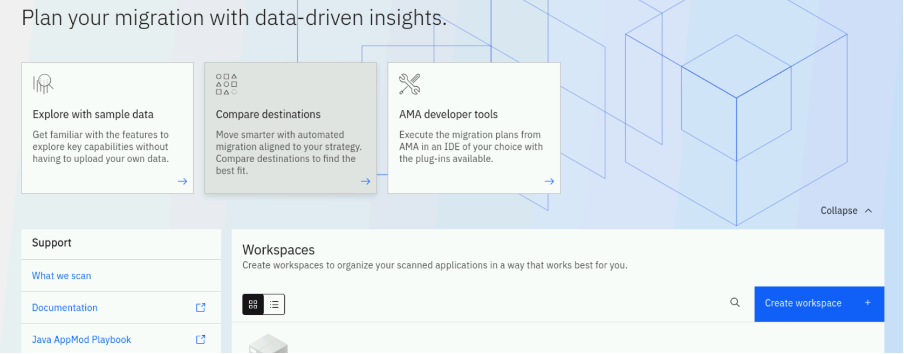</kbd>
    

    3. Click on the button **Create workspace** and enter **Evaluation**, do NOT select **include sample data**, then click on **Create**.

        <kbd>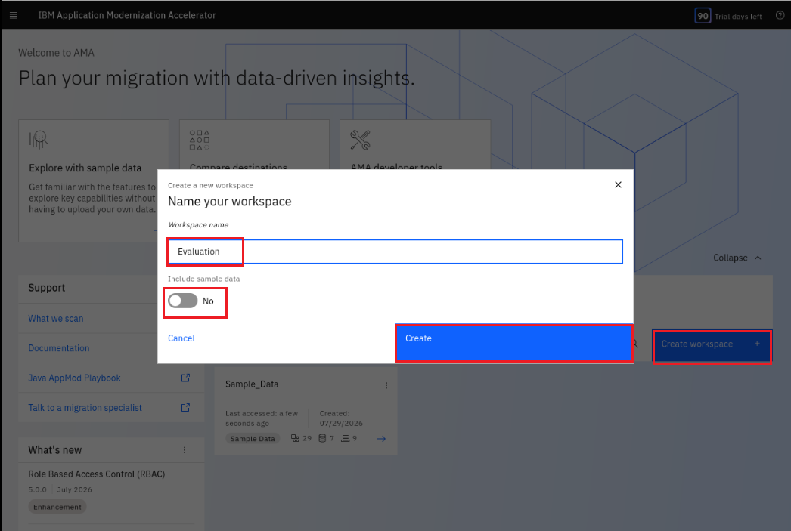</kbd>
    
    4. An empty workspace will be created, and you will be asked if you want to upload an existing data collection or if you want to use the Discovery Tool.
        <kbd></kbd>
    
    5. Click on **Open discovery tool**.
        <kbd></kbd>
    The Discovery Tool panel opens and provides the option to download the tool; in addition, it provides information how to use the tool. 

    6. Click on **Download discovery tool**.
    <kbd>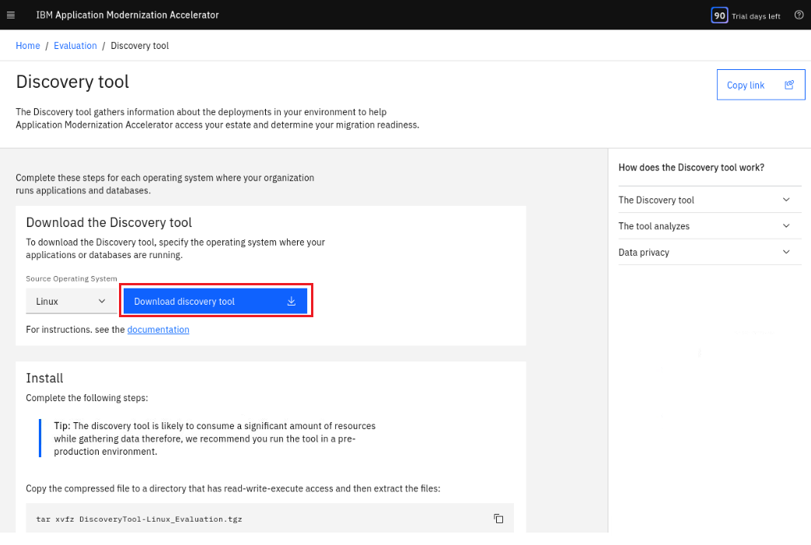</kbd>

        The discovery tool package will be generated and prepared for download.
        Once done, you will likely get a warning, that there is a potential security risk, click on **Advanced** and then **Accept the Risk and Continue**. 

        <kbd></kbd>

    
        The AMA Discovery Tool package will be generated and downloaded.
        <kbd>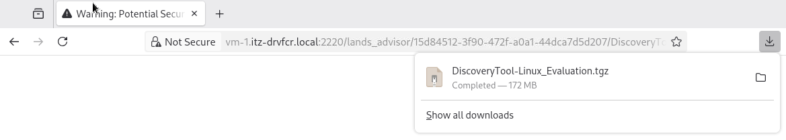</kbd>
    
        It will include next to the scanner also the information to upload the data collection once created.

    7. Click the back button to return to the Discovery Tool page.

        <kbd></kbd>
    
    
### 4.2.2 Use the AMA Discovery Tool to analyze the installed WebSphere Applications

Run the AMA Discovery Tool against your WebSphere environment. After downloading the zipped Data Collector utility, it needs to be unpacked and run against a WebSphere Application server (WAS) to collect all the data of deployed applications and their configuration from the WAS server.

1. Go back to the Terminal window by clicking the *Activities* on the top left corner and navigate the /home/itzuser/Downloads directory and view its contents with commands:

        cd /home/itzuser/Downloads/
            ls -l | grep Discovery

    <kbd></kbd>
            
    You can see the downloaded Discovery Tool file named “DiscoveryTool-Linux_Evaluation.tgz”

    2. Extract the data collector utility to the Student directory using the following command:

            tar xvfz DiscoveryTool-Linux_Evaluation.tgz -C ~/Student

        The Discovery Tool will be extracted to ~/Student/ama-discovery-5.0.0 directory.

        Note: At this point, the data collector is ready to execute against a WebSphere environment.

    3. Return to the AMA UI in the Web browser to view the section on “Run the Tool”, which shows the command to run on the WebSphere environment.

        a. From the Discovery Tool page, scroll down to the “Run Tool” section.

        <kbd>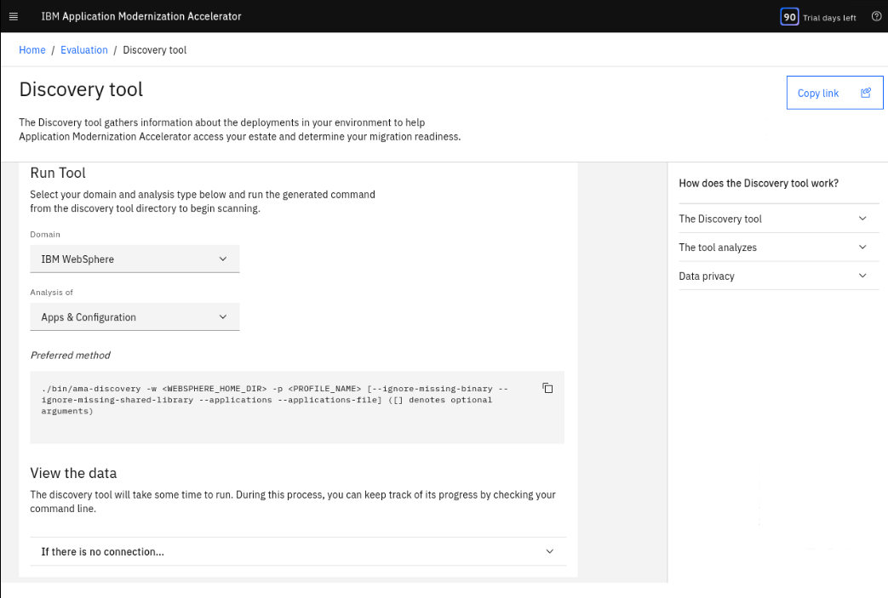</kbd>
        
        The Discovery tool command that would be executed is based on the domain and analysis type selections you make in this section.

        b. Select the domain.

        Open the twisty to see the different domain options:

        <kbd>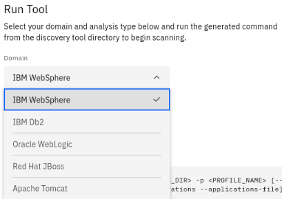</kbd>
        
        
        Finally, choose the **IBM WebSphere** Domain. 

        c. Select the Analysis type
        
        Open the twisty to see the different analysis types:

        <kbd></kbd>
        
        Choose the **Apps & Configuration** analysis. 
        Selecting **Apps & Configuration** ensures that the application data and server configuration data is collected.
 
        The server configuration data is extremely helpful in AMA to generate deployment artifacts in the migration bundle.
 
        d. Review the final command.
        To analyze the application and configuration for WebSphere will be done using a command as shown in the screenshot
        <kbd></kbd>
    

### 4.2.3 Execute the AMA Discovery Tool

1. Go back to the Terminal window and navigate the directory where the AMA Discovery Tool was extracted, then list the content:

            cd ~/Student/ama-discovery-*
            ls -l

    <kbd></kbd>

    2.  Execute the following command to start the AMA Discovery Tool:

            ./bin/ama-discovery -w ~/usr/IBM/WebSphere/AppServer

        <kbd></kbd>

        The license agreement will be displayed, and you will be asked to accept it. 
        
        <kbd></kbd>
        

        Type **1** to accept the license agreement and press **Enter**.

    3. Wait until the analysis has completed. As you can see, 1 application has been analyzed, and the resulting data collection has been automatically uploaded. 

        The collection is also available as zip file in the directory where the discovery tool was called. It is named like the WAS profile.

            ls -l

        <kbd></kbd>

        Comments: 
        - In the lab, the process only takes a couple of seconds. In a real scenario, the process typically takes some time to complete, depending on how many applications are deployed on the WebSphere Application server and the complexity of the applications. As this process consumes some CPU and memory, it is not recommended to run the discovery tool in production.
        - You might have recognized that the WebSphere applications were discovered even though the WebSphere instances were stopped. This is due to the fact that the discovery tools looks into the WebSphere files instead of connecting to a running instance.
        - In the lab environment, the discovery tool can connect to the AMA instance via port 2220. Therefore the collected data has been automatically uploaded. If this is not the case, you must copy over the data collection zip to another system and manually upload the data to AMA from that system before you can view the results. 
        - You can also specify in the ama-discovery command not to upload the data collection automatically. 

    4. Return to the AMA UI in the Web browser and you can see that the data collection has been uploaded. 
    
        <kbd>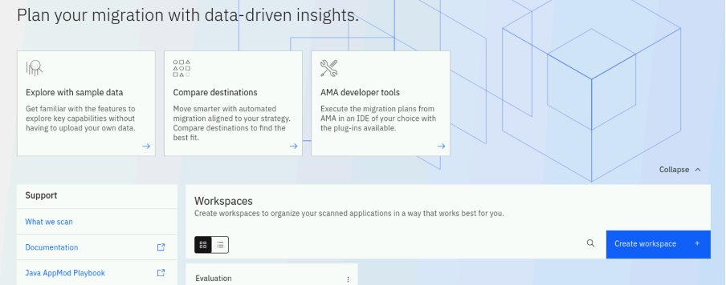</kbd>

    5. Click on the **Evaluation** workspace to open it.  
    You will be asked to specify the modernization destination. Select **Liberty administered from WebSphere (MoRE)** as the destination, choose **Java SE 21** under the Standard edition and then click on **Confirm**.
    <kbd>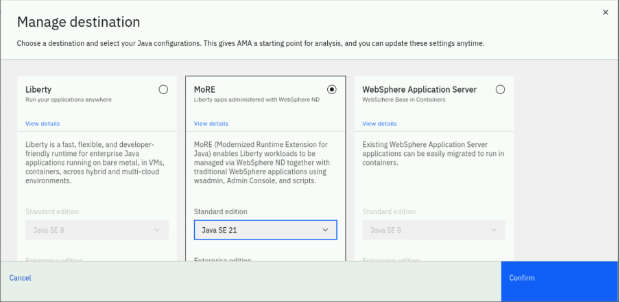</kbd>
    

        The Evaluation workspace will open in the Visualization View. 
    
        <kbd></kbd>

   6. Switch to the Assessment View.

        <kbd></kbd>

    You can see the assessment details for the 4 applications and the efforts to modernize them to MoRE.

    <kbd>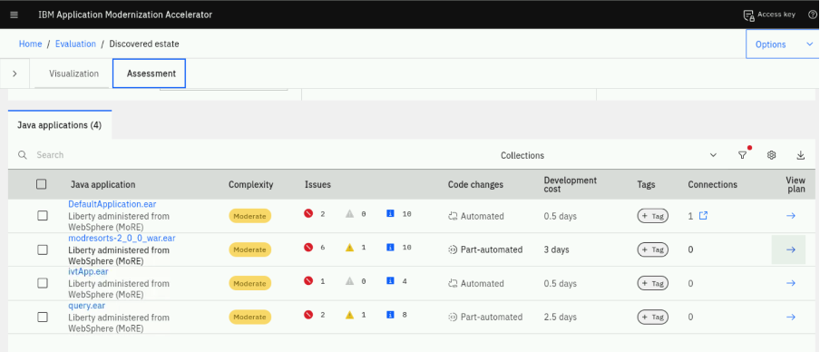</kbd>

    7. Click on the modresorts-2_0_0_war.ear to view its migration details. Click on **Inventory report**, **Technology report** and **Analysis report** to learn more details.

        <kbd>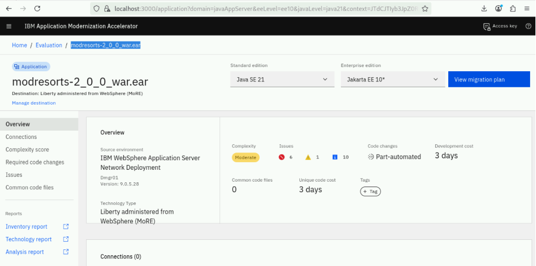</kbd>

    8. Click on **View migration plan** on the top right to view the Download migration plan.

    9. Click on **Download plan** to download the **Migration Plan** generated by AMA.

        <kbd>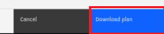</kbd>

    The migration plan will be downloaded to the Downloads directory.
        <kbd></kbd>

    10. Switch to the terminal window and execute the following command to see the content of the migration bundle. 

            unzip -t ~/Downloads/modresorts-2_0_0_war.ear_migrationPlan.zip 

        <kbd>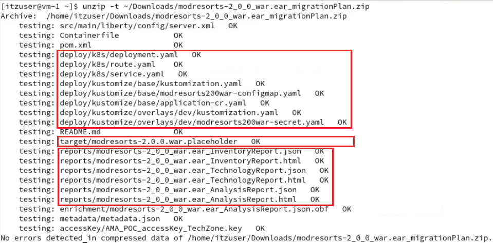</kbd>

    11. Close the browser window containing the AMA UI.

### 4.2.4 Recap

Congratulations, you have finished the application assessment part.

**Let’s recap what you did so far.** 

- You installed and tested the modresorts application on a traditional WAS instance
- You ran the AMA Discovery Tool to assess a WebSphere cell
- You assessed the modresorts application
- You generated a migration plan

You will then use IBM Bob to modernise the application.

# 5. Modernise the application using IBM Bob

## 5.1 Explore the IBM Bob installation and complete setup

### 5.1.1 Initialize git

Open a terminal window and switch to the project directory, then initialize git.

        cd ~/Student/modresorts-project
        git init
        git config --global user.name "John Doe"
        git config --global user.email john.doe@noreply

        git add .
        git commit -a -m "Initial project"

        

### 5.1.2 Open IBM Bob

1. Start the IBM Bob IDE

            bobide . &

    The IBM Bob IDE will be opened.

    If you get a Welcome panel offering to import settings, click on **Skip for now**,

    <kbd></kbd>
        

    2. If you get a pop-up that a Bob update is available, click on settings and select **Keep current version**.

        <kbd></kbd>

        <kbd></kbd>
       

    3. If you get a **Bob Getting Started** panel, close it:

        <kbd></kbd>

    4. If you see during the lab a pop-up like below or any other pop-up asking to install something, close the pop-up without installation by clicking the **X**. 

        <kbd></kbd>

    5. Look at the bottom left of your Bobide window to find out if Bobide runs in Restricted Mode.

        <kbd>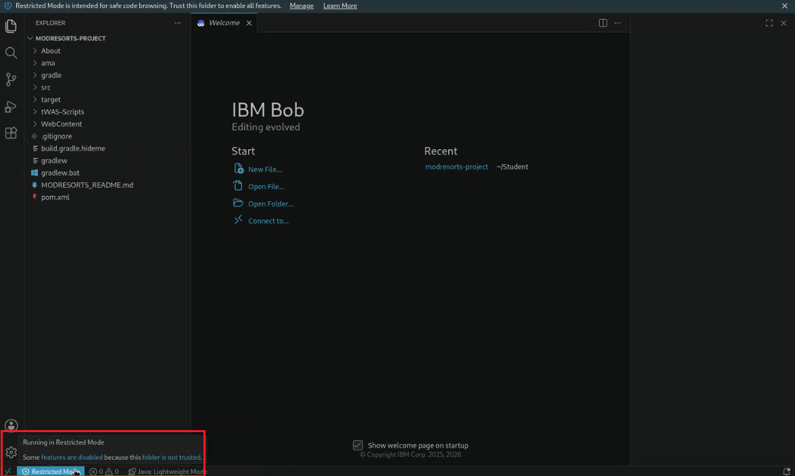</kbd>

        If so, click on the field **Restricted Mode** to open the panel.

        <kbd>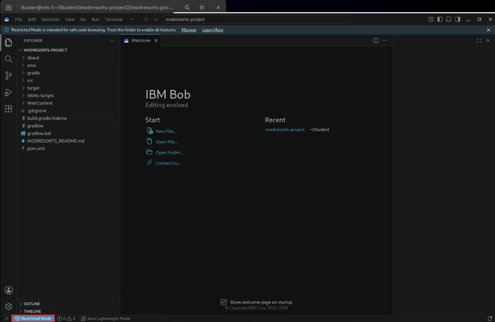</kbd>

        Then click on **Trust** to make this workspace trusted.
        <kbd>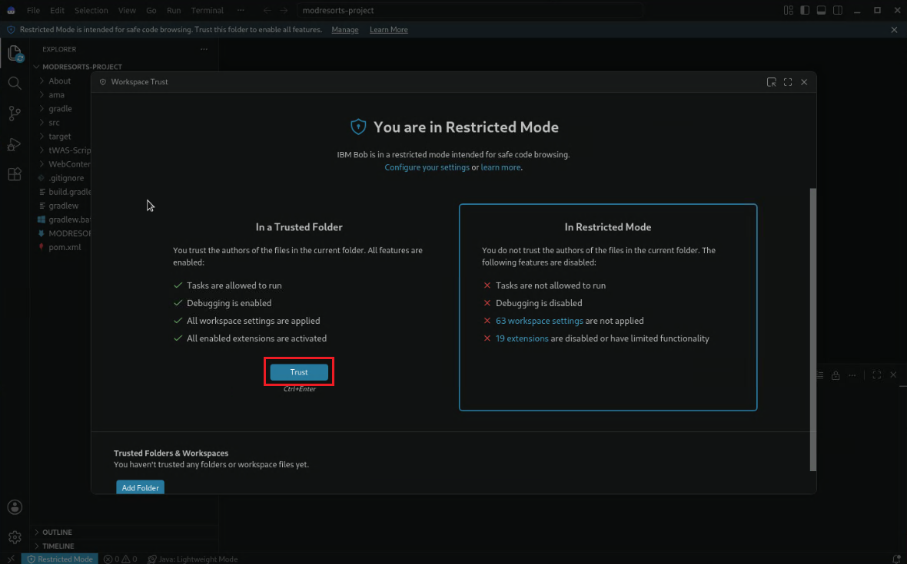</kbd>

        Finally, close the pop-up by clicking on **X**.
        <kbd>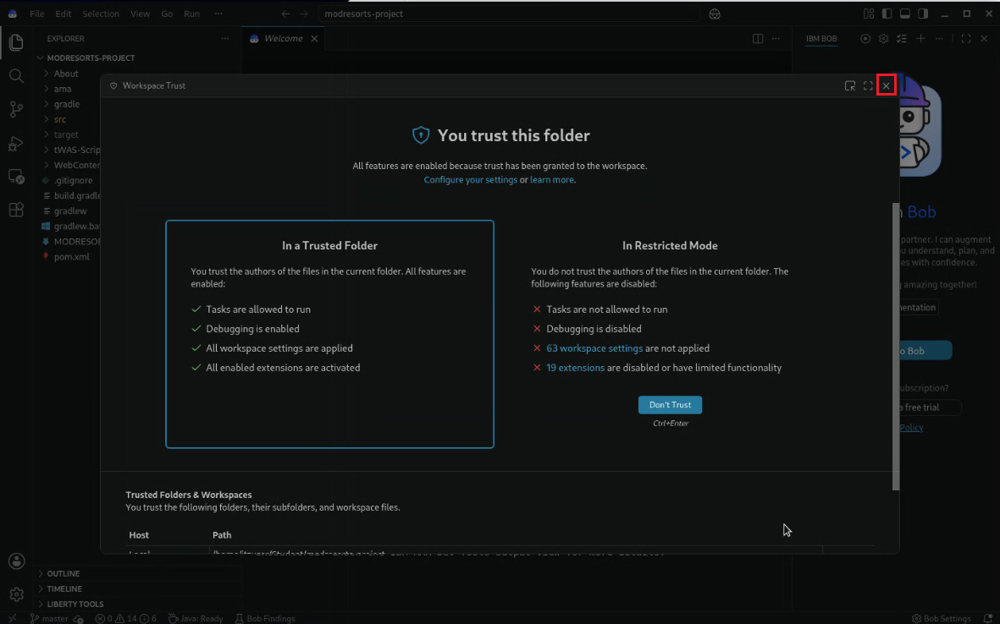</kbd>

        If you used Bob before, you might see a **Migration** panel like this:

        <kbd></kbd>

        Click on **Skip migration** to continue.

        
    6. The lab document uses the color theme **Bob Theme**. If you want to change your theme, you can do so under **settings** on the bottom left corner of your IDE. 

        <kbd>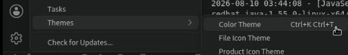</kbd>

### 5.1.3 Take a look at the installed extensions

1. Open the Extensions panel

    <kbd>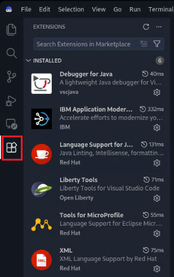</kbd>

2. Click on the extension called **Liberty Tools**. The Liberty tools provide an easy way to develop against Liberty

    <kbd></kbd>

Look at the details, then close the Liberty Tools Extension panel.
You might have a newer version displayed.
    
You will use the Liberty Tools Extension during the lab.

### 5.1.4 Log into IBM Bob
1. On the right side of the IDE, click on the button **Log in to Bob** 

    <kbd>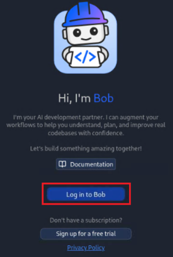</kbd>

2. On the pop-up, click on **Allow**. 

    <kbd>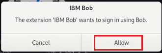</kbd>

Click on **Open**

<kbd></kbd>

A browser window will open.

<kbd>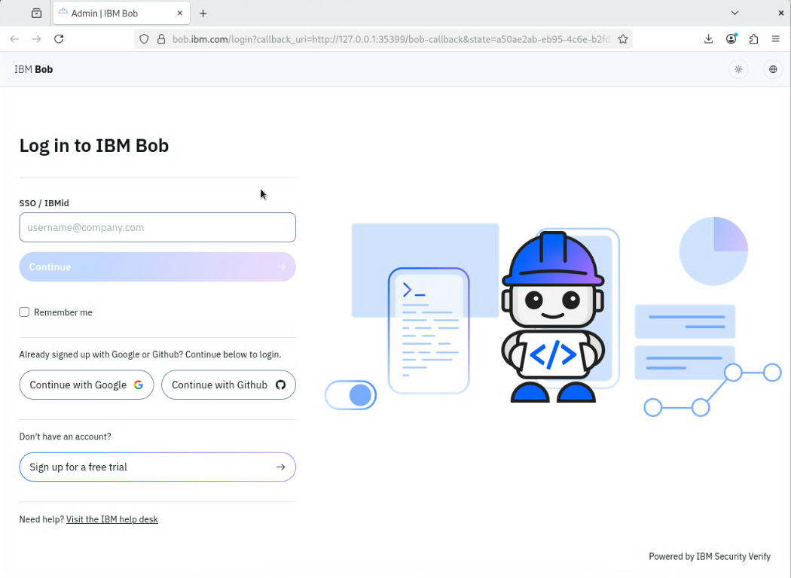</kbd>

3. Choose a way of login and enter your login credentials.

<kbd></kbd>

The example uses SSO with the IBMid.

4. On the new browser page, select **Open Link**

<kbd></kbd>

You should see a panel like this:

<kbd>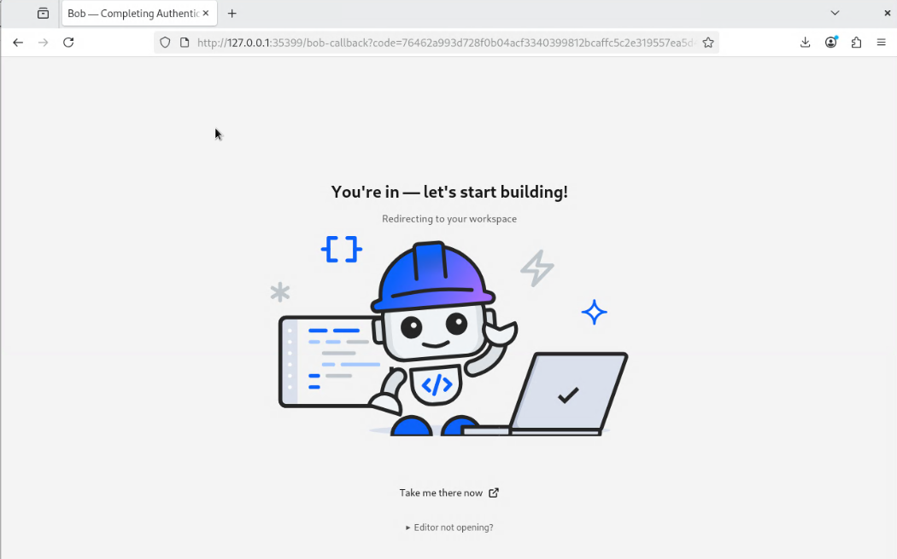</kbd>

5. Switch back to the IBM Bob IDE and you should see a pop-up like this:

<kbd></kbd>

Click on **Open**.

You should now have access to IBM Bob and the IBM Bob chat window:

<kbd></kbd>

### 5.1.5 Verify that you use an account that has access to the IBM Premium Package for Java Modernization

1. On the upper right part of the Bob IDE, click on the **Settings** icon.    Then take a look at the account:
    
    <kbd></kbd>
      
    If you have a user with access to the premium package, it is listed under add-ons (see above). 
        
    You should have an account that has access to the premium package.
    
    <kbd></kbd>
    
### 5.1.6 Install the premium package extension:
    
1. In the list of **Add-ons**, click on the **Install** button next to **IBM Premium Package for Java Modernization**.
    
    <kbd></kbd>
    
2. In the pop-up, click on **Trust Publisher & Install**.
    
    <kbd>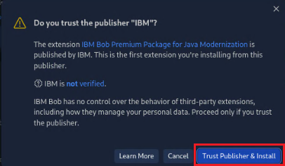</kbd>

3. Finally, you should see something like this:

    <kbd></kbd>
    As you can see, you could start the modernization workflow from here.

4. If the **IBM Bob** Panel on the right is not open, click on the **Bob** icon to open it.

    <kbd></kbd>

    
5. In the **IBM Bob** panel, click on the workflow icon and take a look at the Bob workflows that are offered. 
    
You should see different workflows including the ones for Liberty Modernization (which are expanded in the screenshot below):

<kbd>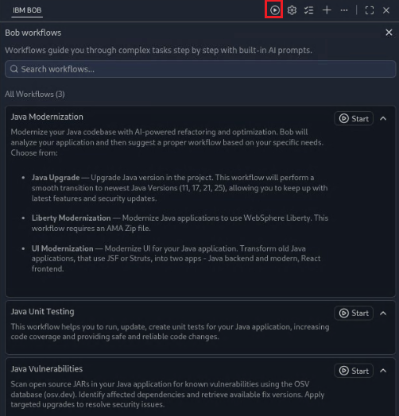</kbd>

### 5.1.7 Modernize Modresorts to WebSphere Liberty using IBM Bob
In the section you will use the **Java Modernization** to modernize the application to Liberty. 

1. Start the Java Modernization workflow

    1. In the **Bob** panel, click on **Permissions** on the bottom to see which activities IBM Bob is allowed to do without approval. Set the settings to **Read**.
    This will allow you to better understand the workflow and decisions.

        <kbd></kbd>

    2. In the **Bob** panel, expand the Java Modernization workflow and click on **Start**.

        <kbd></kbd>

    3. Click on **Continue**.

2. Bob prepares the modernization

    1. Bob has detected that the application uses Spring and offers to analyze the application for vulnerabilities. 
    
        <kbd>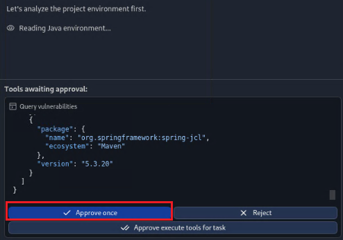</kbd>

        Click on **Approve once**.

    2. Next Bob wants to perform an initial build of the application. 
    
        <kbd>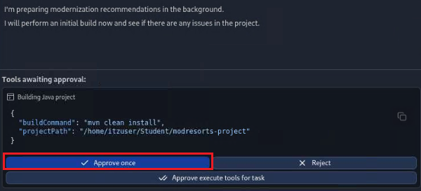</kbd>

        Click on **Approve once**.

    4. Bob offers different options of application modernization. Select **Liberty Modernization** and select to **Disable Git Flow**.
    
        <kbd></kbd>

        Click on **Continue**.

3. Upload and extract Migration plan

    Bob wants to read the AMA migration plan to better understand the modernization target and identified issues. The modernization plan will help to do the modernization in a more deterministic way. 
    1. Click on **Select File**

        <kbd>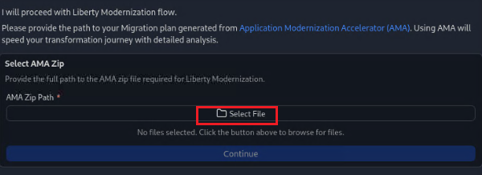</kbd>

    2. Click on **Downloads**, then select the migration plan and click on  **Select File**

        <kbd>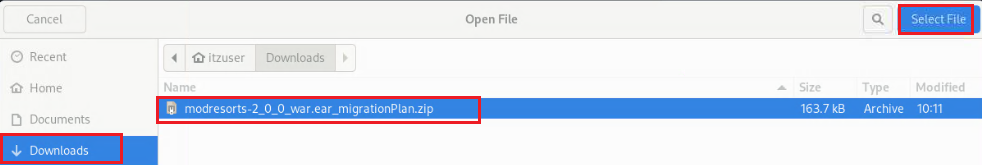</kbd>

    3. Verify that the migration plan has been selected and click on  **Continue**

        <kbd>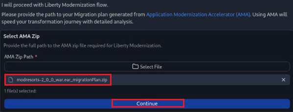</kbd>

    4. Bob extracts the migration plan and wants to save the embedded Liberty server configuration file **server.xml**. Click on  **Approve once** for server.xml.

    5. Bob has analyzed the AMA reports and knows which issues have been identified. As  next step, Bob wants to Run OpenRewrite Recipes for the automated fixes. Click on **Approve once** to apply the automated fixes.

        <kbd></kbd>

    
        After Bob has applied the recipes, you can see that the **LogoutServlet.java** and the **Weatherservlet.java** have been changed. 
    
    4. To better compare what has changed, switch to the **Source Control** view and compare the files. Some files have been changed. For an instance,

        - The file **server.env** has been created to make Liberty use Java 21.
        - The files **LogoutServlet.java** and the **Weatherservlet.java** have been changed by the recipes. 
        
        Click on **LogoutServlet.java** to view the changes.
        <kbd>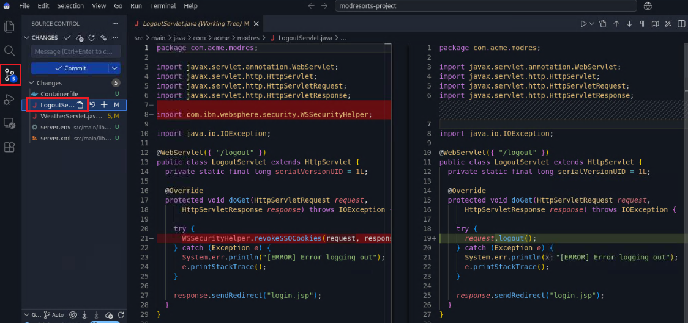</kbd>

    5. After reviewing the changes, close the comparison.

        <kbd>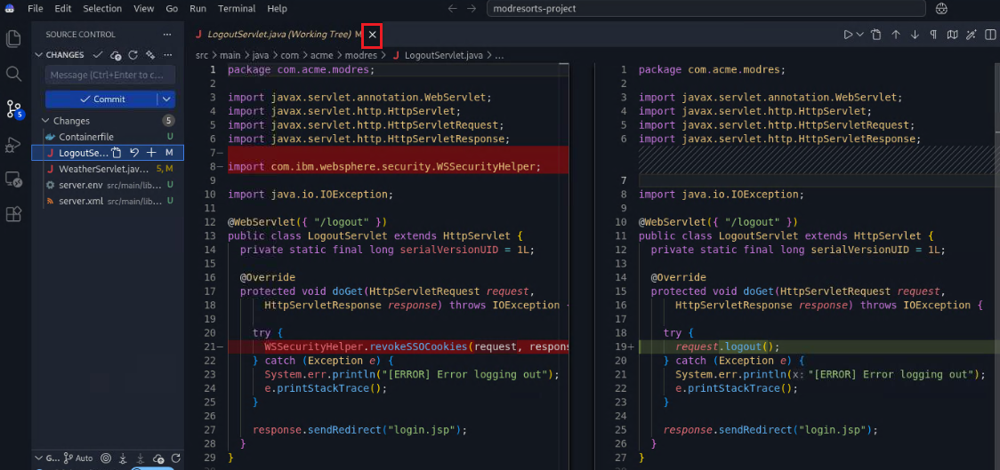</kbd>

3. Now that Bob resolved all issues with automated fixes via recipes, Bob will take a look at the remaining issues and will use agentic AI to resolve them. While the overall resolution steps will stay the same, there might be differences in the order and the recommendations provided by Bob.

    1. Fix the issues around **Behavious changes**

        1. Bob wants to start a new subtask to fix the issues.

            <kbd>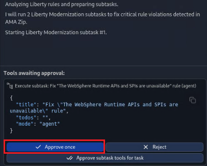</kbd>

            Click on **Approve once** to continue. 

        2. Bob creates a subtask and a **Todo** list to fix the issue based on the recommendations from the AMA migration plan. Click Click on **Approve once** to continue.

           

            Review the Todo list (you could also edit it to add or remove steps). Finally, click on **Approve once** to continue. 

        3. You might have to click on **Approve once** to continue a few times until Bob finishes the todolist. Afterwards, Bob asks whether you want the changes to be applied. 

            <kbd>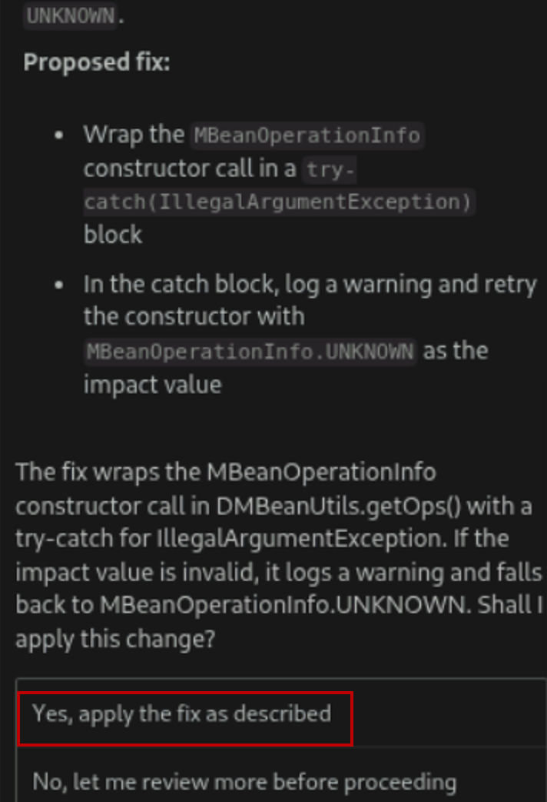</kbd>

            Click on **Yes, apply the fix as described** to continue. 

        4. Bob applies the changes and ask for approval. Click on **Approve once** to continue a few times. 

            <kbd>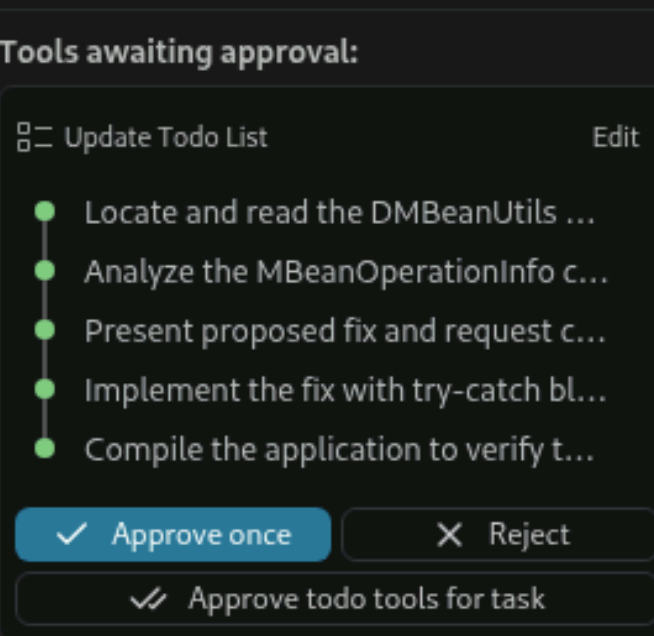</kbd>

            Click on **Approve once** to continue. 
    
        5. Bob wants to execute the command "mvn compile". 

            <kbd>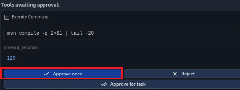</kbd>

            Click on **Approve once** to continue. 

        6. Bob wants to update the Todo list.

            <kbd></kbd>

            Click on **Approve once** to continue. 

        7. Bob wants to complete the subtask. Click on **Approve once** to continue. 

    2. Fix the issues around **Behavious changes**  
        
        <kbd>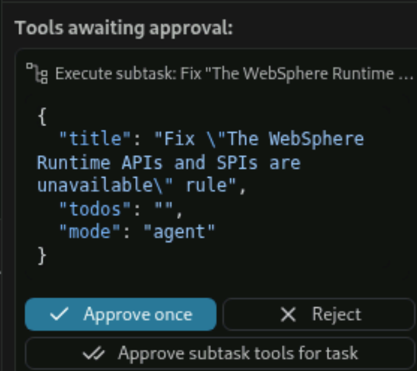</kbd>

        Review the task and click on **Approve once** to get continue.  

    3. Fix the issues around **WebSphere Servlet API**

        1. Bob wants to start a new subtask to fix the issues around the WebSphere Servlet API. 
        
        2. Bob creates a subtask and a Todo list  to fix the issue based on the recommendations from the AMA migration plan.

            <kbd></kbd>

            Click on **Approve once** to get continue. 

            Review the Todo list (you could also edit it if needed). 
            To reduce the number of approvals, you can allow Bob to update the Todo list for the subtask without approval. 
            Click on **Approve todo tools for task** to continue. 

        3. Bob find a solution and ready to apply the changes.

            <kbd>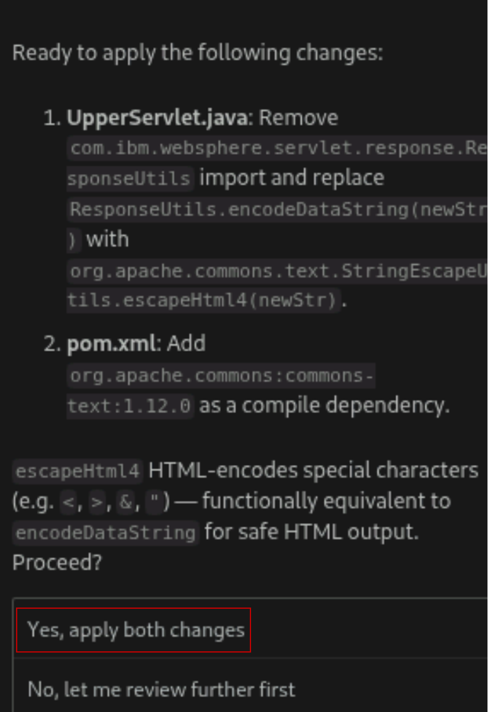</kbd>

            You can select to apply the recommended changes or to use a different approach. Let's see which different approaches are available. Let's use the listed approach by click on **Yes, apply both changes**.   Click on **Approve once** to continue. 

            To reduce the number of approvals for the task, click on **Approve edit tools for task** to continue. 

    3. Bob has completed the tasks related to **Replatform Liberty issues**. 
    
    
        1. The first step is to deploy and validate.

            <kbd>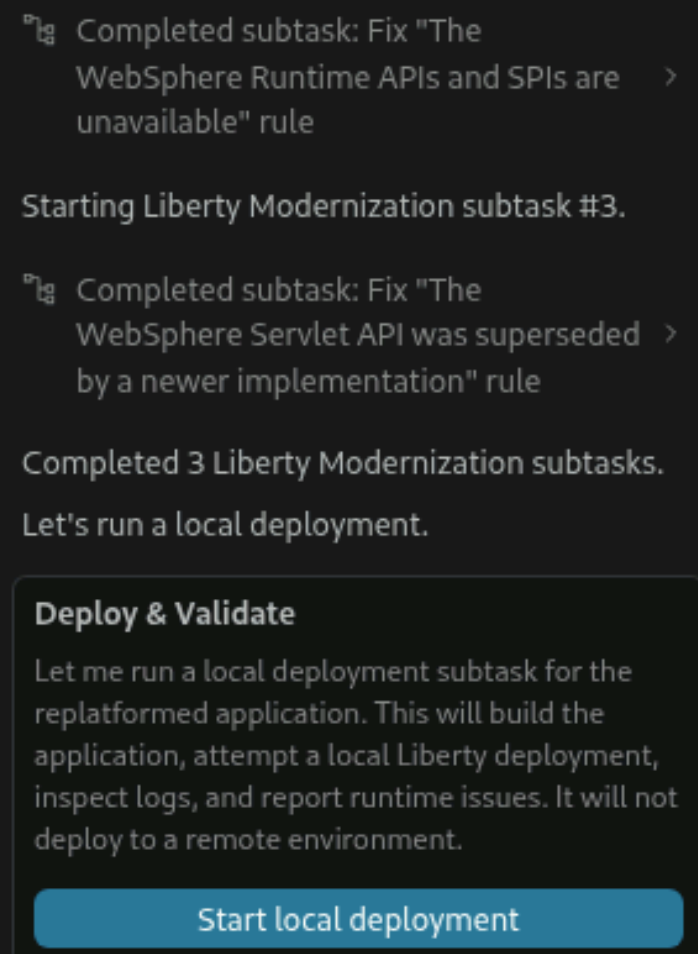</kbd>

            Click on **Start local deployment**.

        2. Bob will ask for permission to start the **Deploy** subtask.

            <kbd></kbd>

            Click on **Approve once** to continue. 

        3. Bob will ask for permission to build the application. Click on **Approve once** to continue. 

        4. Bob rebuilt the application and will ask again for permission to Add Liberty Maven Plugin to pom.xml. Click on **Approve Once** for task to continue. 

        5. Click on **Approve Once** a few times in the subtasks. Bob will finish issues if anything is not working.

        6. Bob tested all endpoints successfully. Now it provides deployment summary. 
        
            <kbd></kbd>

           
            
        7. Open the browser and test the application to verify, that the initial issues are resolved. 
        
            In the browser, open the URL http://localhost:9080/resorts. If the port 9080 is in use, the URL would be http://localhost:9081/resorts.
            Then navigate to **Where To > Paris** to verify that the error is gone. Do the same with the **Logout** button. 

        8. Switch back to Bob and click click on **Yes, the application started successfully with no errors** to continue. Then click on on **Approve Once** a few times. Finally, Bob created a summary with a diagram visualizing the performed tasks. 
        
            <kbd>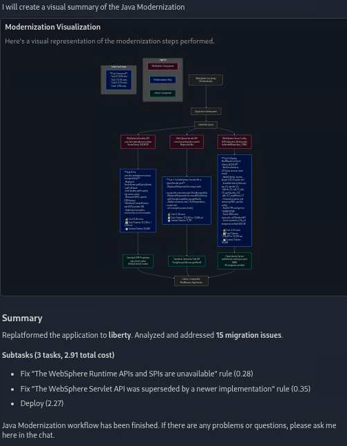</kbd>

            Click on the diagram to expand the diagram. 

            As you can see, the diagram contains details about the performed modernization as well as details about the costs and tokens for the different tasks.    
        
        9. ask Bob to stop the Liberty instance.

                Stop Liberty

            <kbd></kbd>
    4. Copy the new modresorts.war for the deployment to MoRE.
    The newly built modresorts-2.0.0.war by Bob is located under targe directory.
        <kbd>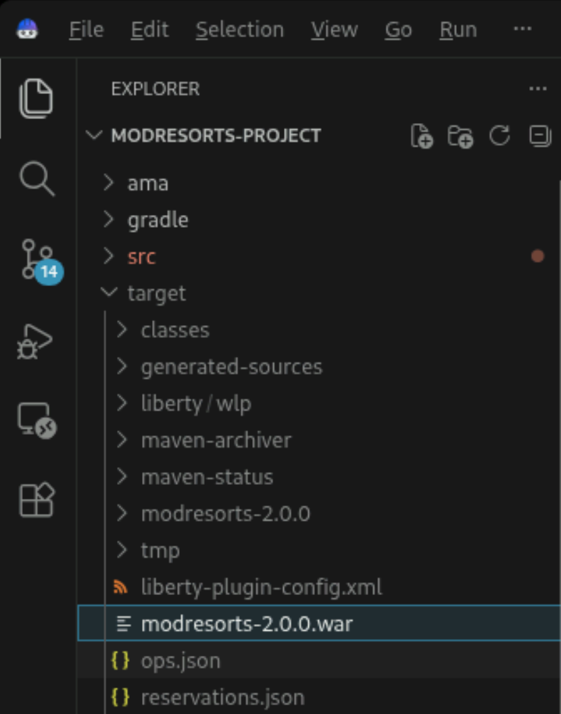</kbd>

        Copy the generated war file into the assets directory
    
            cp ~/Student/modresorts-project/target/modresorts-2.0.0.war ~/Student/assets/modresorts-more-2.0.0.war

You should now have a good understanding how IBM Bob can help to modernize your applications. 

### 5.1.8 IBM Bob Recap

Congratulations, you have finished the application modernization part.

**Let’s recap what you did so far.** 

- You used the IBM Bob to apply automated fixes via fixes
- You used the IBM Bob to apply agentic AI to fix the remaining issues. 
- You tested successfully the modernized application on Liberty
- You got an idea how to use IBM Bob to upgrade the Java SE or Java EE level of the application.
- You also should have a good understanding how to use Bob for troubleshooting migration issues.

The next step is to deploy the application to MoRE.

# 6. Deploy the modernized modResorts to MoRE

In this section, you will install the modernized modResorts to MoRE.

1. Open a terminal window and enter the following commands to start the servers:

    ~/Student/modresorts-project/tWAS-Scripts/WAS_905_Cell_start.sh

After the script completes, the message `All servers have been started!` is displayed.

---
## 6.1 Creating a managed Liberty server

This section guides you through the process of creating a managed Liberty serve.

You can use either of the following methods to complete this task:
* If you prefer a visual, step-by-step experience, continue with [Option 1: Using the administrative console](#option-1-using-the-administrative-console).
* If you prefer automation or scripting, skip ahead to [Option 2: Using administrative scripting](#option-2-using-administrative-scripting).

## 6.2 Option 1: Using the administrative console

1. Switch to a brower window. Launch the **WAS Admin Console** by selecting **WAS** from your browser bookmarks or navigating to the https://localhost:9043/ibm/console URL.

   Log in using the following credentials:
   * User ID: `wasadmin`
   * Password: `password` 

2. Navigate to **Servers** &rarr; **Server Types** &rarr; **WebSphere application server clusters**. Click **New...** and then **Managed Liberty server** to create a new Managed Liberty server.

   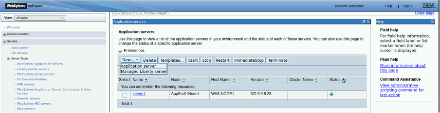

3. On **Step 1**, enter **txc** to Server name. Leave the other fields as default. Click **Next**.

 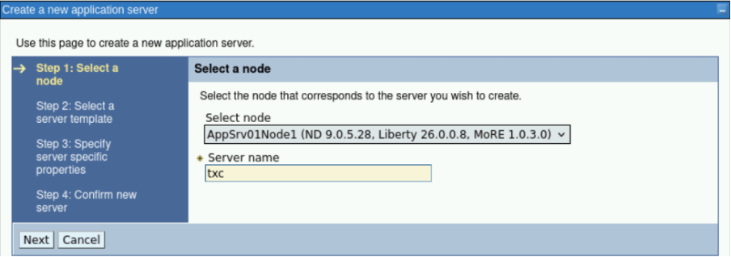

4. On **Step 2**, leave all other settings as default. Click **Next**.

5. On **Step 3**, leave all other settings as default. Click **Next**.

6. On **Step 4**, review the configuration summary and click **Finish**.

7. Click <ins>Save</ins>.

   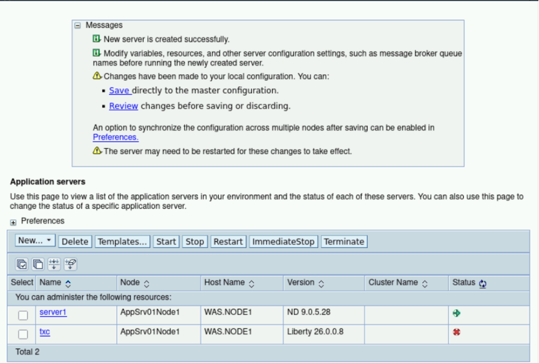

## 6.3 Option 2: Using administrative scripting

Run the following command to create a Managed Liberty Server using the provided Jython script [`MLS_create.py`](tWA-Scripts/MLS_create.py):

    ~/usr/IBM/WebSphere/AppServer/profiles/Dmgr01/bin/wsadmin.sh -lang jython -user wasadmin -password password -f ~/Student/modresorts-project/tWAS-Scripts/MLS_create.py

---
# 7. Deploy the modernised application ModResort to MoRE

The modernised WAR file `modresorts-more-2.0.0.war` was copied to the directory (~/Student/assets) and will be used for deployment to the Liberty server.

## 7.1 Option 1: Using the administrative console

This section walks you through deploying the application using the administrative console.

If you prefer to use a script, skip ahead to [Option 2: Using administrative scripting](#option-2-using-administrative-scripting).

### 7.1.1 Installing the application WAR file

1. Launch the **WAS Admin Console** by selecting it from your browser bookmarks or navigating to the https://localhost:9043/ibm/console URL.

2. Go to **Applications** &rarr; **New Application** &rarr; <ins>New Enterprise Application</ins>.

   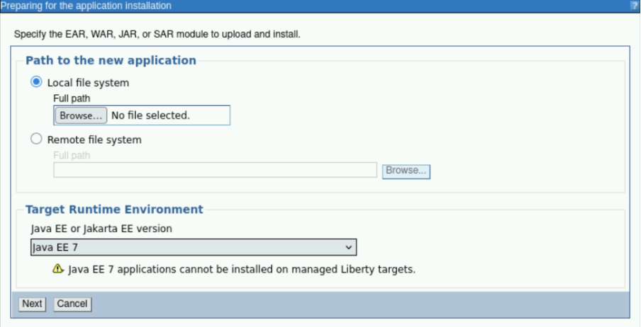

3. In the installation panel:

   * Under **Path to new application**, select **Local file system** and choose the WAR file located at `/home/itzuser/Student/assets/modresorts-more-2.0.0.war`
   * Set **Target Runtime Environment** to `Jakarta EE 10`
   
   Click **Next** and wait for the application to upload.

   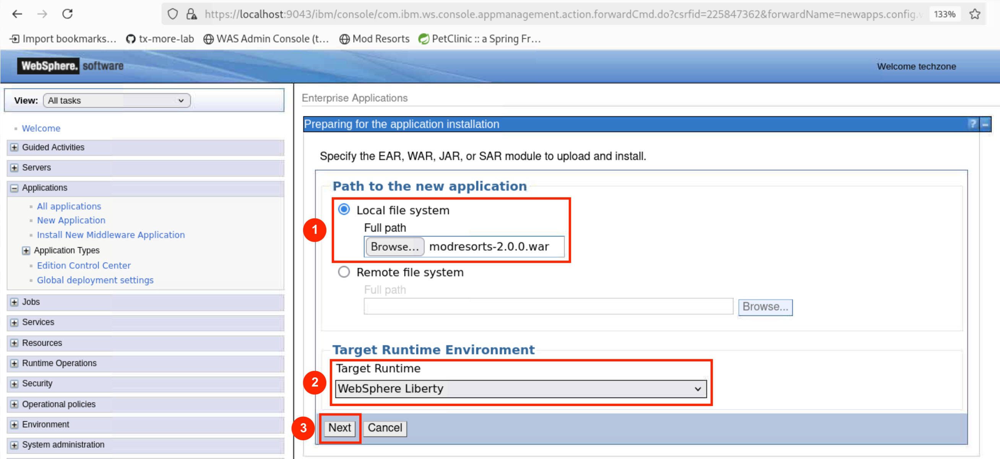

4. Choose **Fast Path** and click **Next**.

5. Leave **Step 1** unchanged and click **Next**.

6. Leave **Step 1** unchanged and click **Next**.

7. On **Step 3**, confirm that the **Context Root** is set to `/resorts` and click **Next**.

8. On **Step 4**, review the installation summary and click **Finish**.

9. After the installation completes, click <ins>Review</ins>. 
   
   Select **Synchronize changes with Nodes**, and click **Save**. Click **OK** when synchronization is complete.

10. Start the Managed Liberty server.
Navigate to **Servers** &rarr; **Server Types** &rarr; **WebSphere application server clusters**. Tick the box next to **txc** and then click **Start**.

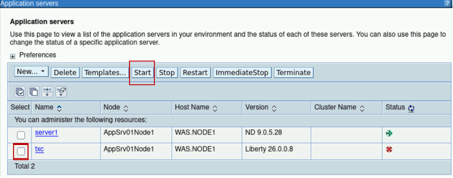

You will then see the message that the server started successfully.

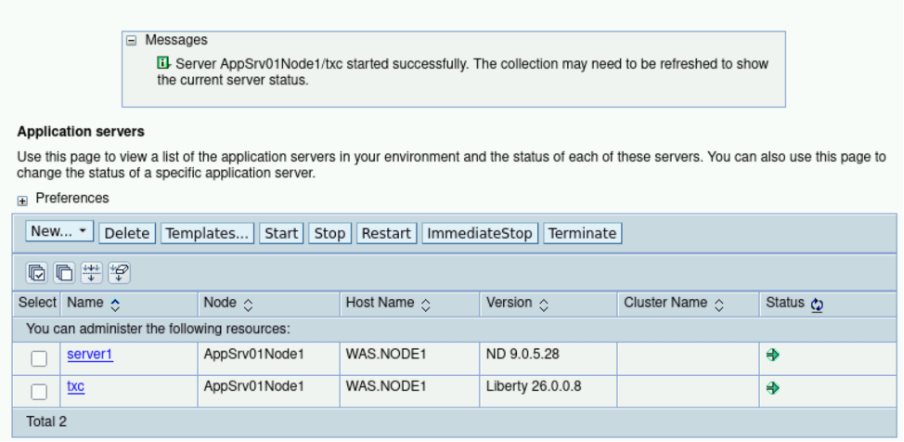

## 7.2 Option 2: Using administrative scripting

This section walks you through deploying the application using the administrative console.

Run the following command to deploy the application using the provided Jython  script:

    ~/usr/IBM/WebSphere/AppServer/profiles/Dmgr01/bin/wsadmin.sh -lang jython -user wasadmin -password password -f ~/Student/modresorts-project/tWAS-Scripts/MLS_install_modresorts.py

The script performs the following actions:

* Installs the `modresorts-more-2.0.0.war` WAR file to the managed Liberty server `txc`. It then started the Managed Liberty server.

After the script finishes, the message `ModResorts successfully deployed!` is displayed. Wait for a while to let the application to start. Verify that the application is running by following the steps in [Checking out the application](#checking-out-the-application).

## 7.3 Checking out the application

Because the application is accessible, use the following URLs based on the connection type:
* http://localhost:9081/resorts

To confirm the application is functioning correctly, launch it and open the **Where to?** drop-down menu. Select any destination from the list—if successful, the relevant weather details should load and display without error messages.

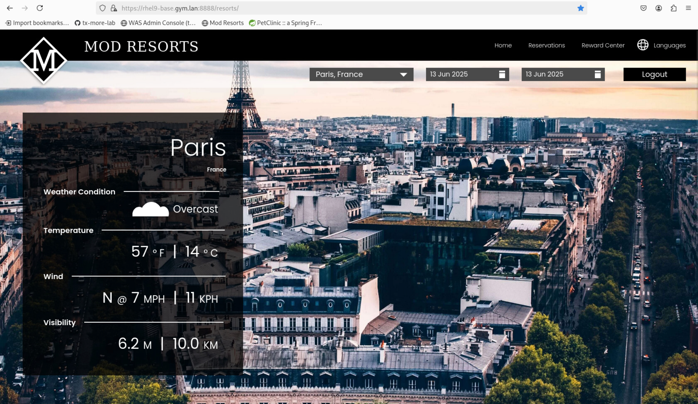

---

